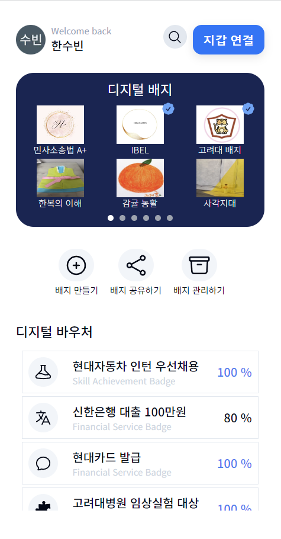
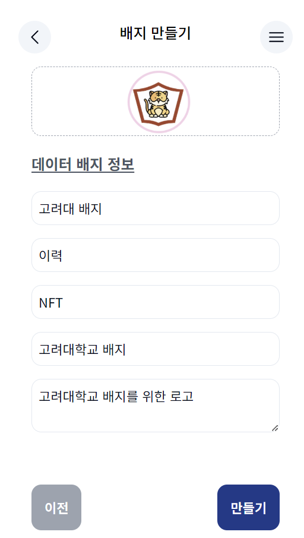
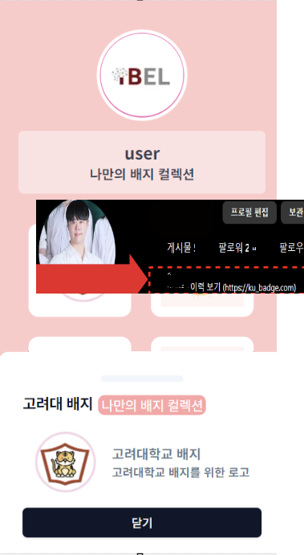

# Data Badge
`Data Badge` is a service that enables the creation and utilization of blockchain-based data badges. Users can prove their lifestyle activities from anywhere, online or offline, and share them with a wide audience. By leveraging this service, individuals can engage in trusted transactions and opportunities across various industries without concerns about privacy infringements.

## Main features
1. **Data Badge Creation** : Users can create blockchain-based data badges.
2. **Data Badge Sharing** : Users can create badge collections with verified badges and upload them to social services.
3. **Proof of Lifestyle Activities** : Users can prove their lifestyle activities online or offline.

## Visuals
<p>
    
    
    
    
    
</p>

## Installation 

Use the package manager [npm](https://www.npmjs.com/package/npm) to install packages.

```bash
npm install
```
Create an `env.local` file within the top-level folder and insert server URL.
```bash
NEXT_PUBLIC_API_URL = (SERVER BASE URL)
```

## Usage & Requirements
Installation of wallet(ex: Metamask) apps or extension programs is required.

## Company Information

Data Badge service is provided by **`IBEL`**. For more information about our company and services, please visit our website [IBEL](https://ibel.korea.ac.kr/).


## License

[MIT](https://choosealicense.com/licenses/mit/)

